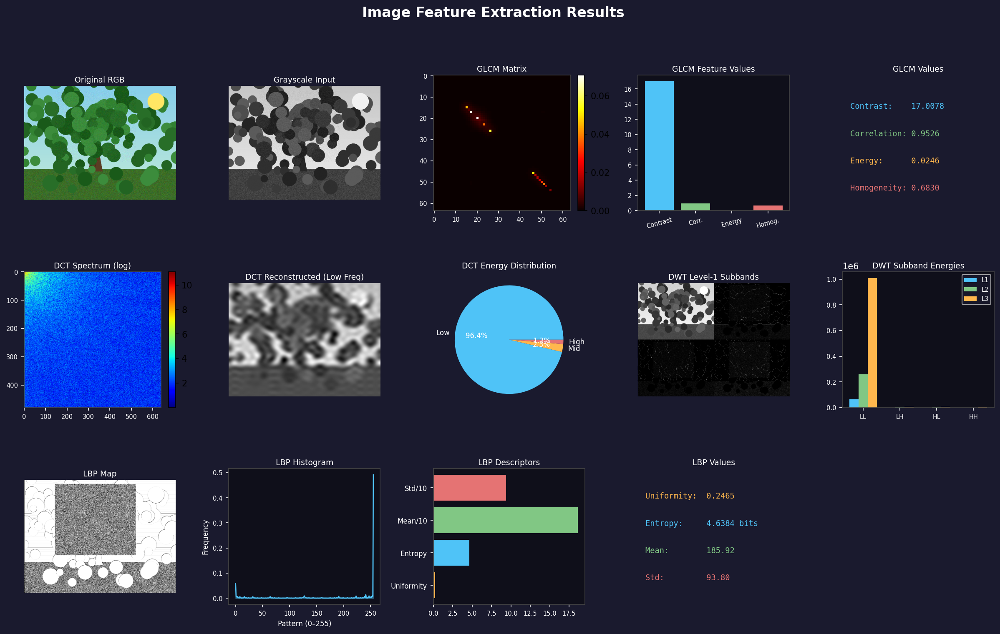

# 📸 Lumira — Vision Feature Lab

A desktop image-analysis application built with Python and Tkinter. Load any image and extract classic computer-vision features interactively, with results visualized live in the GUI.



## Features

- **Color conversion** — RGB → Grayscale (ITU-R BT.601) and RGB → YCbCr
- **GLCM** (Gray Level Co-occurrence Matrix) — contrast, correlation, energy, homogeneity averaged over 4 directions
- **DCT** (Discrete Cosine Transform) — frequency-band energy analysis and low-frequency reconstruction
- **DWT** (Discrete Wavelet Transform) — 3-level Haar decomposition (LL/LH/HL/HH subbands)
- **LBP** (Local Binary Pattern) — circular (8,1) texture descriptor with histogram
- **"Run All"** — extracts every feature at once and renders a combined dashboard

All algorithms are implemented from scratch with NumPy/SciPy (no OpenCV dependency for the core math).

## Project structure

```
.
├── main_project.py        # Tkinter GUI application (entry point)
├── color_conversion.py     # RGB → Grayscale / YCbCr conversion
├── glcm_features.py        # GLCM texture features
├── dct_features.py         # DCT frequency features
├── dwt_features.py         # DWT wavelet features
├── lbp_features.py         # LBP texture features
├── show_results.py         # Matplotlib dashboard renderer
├── requirements.txt
└── results_all.png         # Example output
```

## Getting started

### Prerequisites
- Python 3.9+
- pip

### Installation
```bash
git clone https://github.com/<your-username>/image-feature-extraction.git
cd image-feature-extraction
pip install -r requirements.txt
```

### Run
```bash
python main_project.py
```

Then click **Load Image**, pick a photo, and use the buttons to run each feature extractor individually or all at once.

## Tech stack

- Python, Tkinter (GUI)
- NumPy, SciPy (numerical computation / DCT, DWT)
- Matplotlib (result visualization)
- Pillow (image I/O)

## License

MIT — see [LICENSE](LICENSE).
